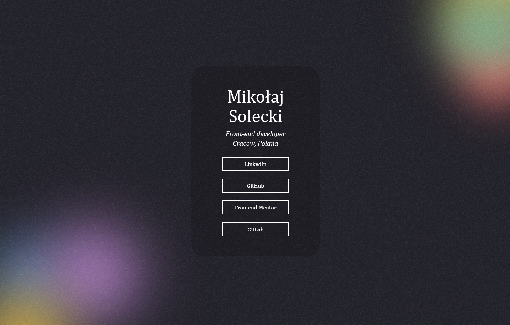

# Frontend Mentor - Social Links Profile Solution

This is a solution to the [Social Links Profile challenge on Frontend Mentor](https://www.frontendmentor.io/challenges/social-links-profile-UG32l9m6dQ). Frontend Mentor challenges help you enhance your coding skills by building realistic projects.

## Table of Contents

- [Overview](#overview)
  - [Screenshots](#screenshots)
  - [Links](#links)
- [My Process](#my-process)
  - [Built With](#built-with)
  - [What I Learned](#what-i-learned)
  - [Continued Development](#continued-development)
  - [Useful Resources](#useful-resources)
- [Inspirations](#inspirations)
- [Author](#author)
- [Acknowledgments](#acknowledgments)

## Overview

### Screenshots

**Template:**

**Finished Version:**

### Links

- Solution URL: [GitHub Repository](https://github.com/123Mikolaj/frontendmentor-social-links-profile/)
- Live Site URL: [GitHub Pages](https://123mikolaj.github.io/frontendmentor-social-links-profile/)

## My Process

### Built With

- Semantic HTML5 markup
- CSS custom properties
- Flexbox for layout
- CSS animations
- SVG filters for visual noise effects

### What I Learned

Through this project, I improved my ability to use semantic HTML5 elements for structuring web content. I also enhanced my CSS skills, focusing on:

- **Flexbox Layout:** Effective use of Flexbox for centering and aligning content.
- **CSS Animations:** Creating dynamic and interactive effects with CSS keyframes.
- **SVG Filters:** Applying SVG filters for background noise effects to add visual interest.
- **Tab Functionality:** I learned how important semantic HTML is for enabling tab functionality and ensuring that interactive elements are accessible to all users.

### Continued Development

For future projects, I plan to:

- Experiment more with noise and animations.

### Useful Resources and Inspirations

- **[Juxtopposed - Creating Noise Effects with SVG Filters](https://www.youtube.com/watch?v=_ZFghigBmqo&ab_channel=Juxtopposed)**: This YouTube video was a major inspiration for incorporating noise effects into my project. It provided valuable insights on using SVG filters to create visually engaging background textures.

## Author

- Frontend Mentor - [@123Mikolaj](https://www.frontendmentor.io/profile/123Mikolaj)
- LinkedIn - [Mikołaj Solecki](https://www.linkedin.com/in/mikolaj-solecki/)
- GitHub - [@123Mikolaj](https://github.com/123Mikolaj/)
- GitLab - [@mikolaj.solecki.123](https://gitlab.com/mikolaj.solecki.123)

## Acknowledgments

A big thank you to the Frontend Mentor community for providing challenging and valuable projects.
